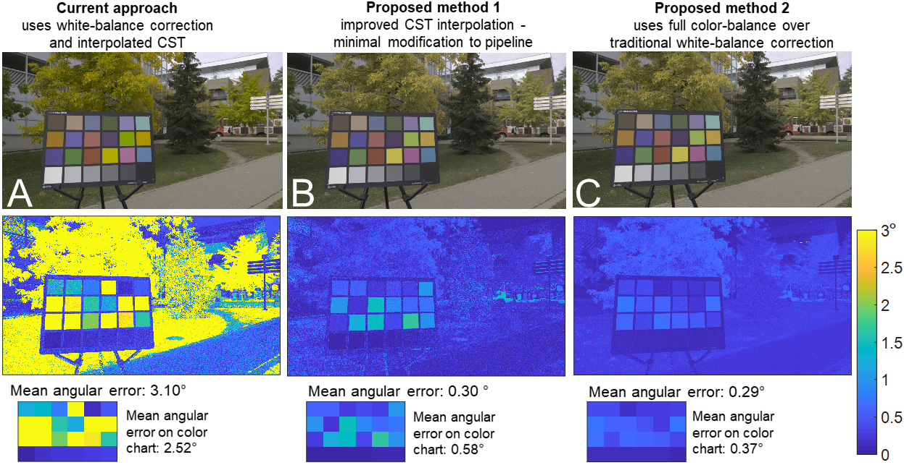

### Abstract ###
 One of the key operations performed on a digital camera is to map the sensor-specific color space to a standard perceptual color space.   This procedure involves the application of a white-balance correction followed by a color space transform.  The current approach for this colorimetric mapping is based on an interpolation of pre-calibrated color space transforms computed for two fixed illuminations (i.e., two white-balance settings).  Images captured under different illuminations are subject to less color accuracy due to the use of this interpolation process.   In this paper, we discuss the limitations of the current colorimetric mapping approach and propose two methods that are able to improve color accuracy.  We evaluate our approach on seven different cameras and show improvements of up to  30% (DSLR cameras) and 59% (mobile phone cameras) in terms of color reproduction error.

#### Publications: ####
* Karaimer H.C., Brown M.S. (2018) "Improving Color Reproduction Accuracy on Cameras", *IEEE Computer Vision and Pattern Recognition* (**CVPR`18**), June 2018 [[pdf]](./paper/camera_color_cvpr2018.pdf) [[bibtex]](./bib/camera_color_cvpr2018.bib) 

## Code and Data##

Please download the code [here](https://github.com/karaimer/camera-color-code),   
Please download the data [here](https://github.com/karaimer/camera-color-data).   

## People ##
[Hakki Can Karaimer](https://karaimer.github.io/), 	karaimer (at) eecs.yorku.ca

[Michael S. Brown](http://www.cse.yorku.ca/~mbrown/), 	mbrown (at) eecs.yorku.ca
