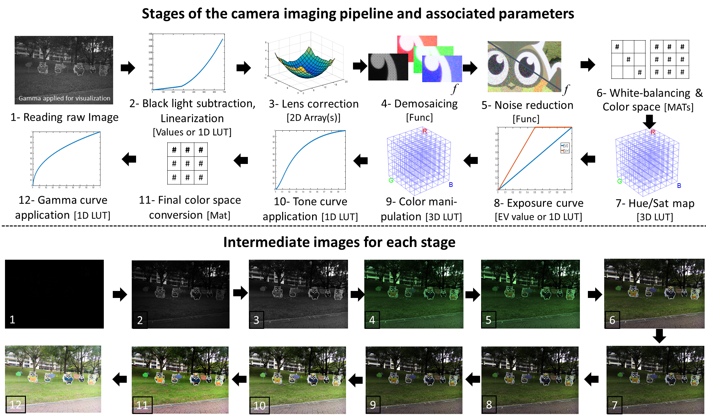

### Abstract ###
 There are a number of processing steps applied onboard a digital camera that collectively make up the camera imaging pipeline.   Unfortunately, the imaging pipeline is typically embedded in a camera's hardware making it difficult for researchers working on individual components to do so within the proper context of the full pipeline.  This not only hinders research, it makes evaluating the effects from modifying an individual pipeline component on the final camera output challenging, if not impossible.  This paper presents a new software platform that allows easy access to each stage of the camera imaging pipeline.   The platform allows modification of the parameters for individual components as well as the ability to access and manipulate the intermediate images as they pass through different stages.  We detail our platform design and demonstrate its usefulness on a number of examples.

#### Publications: ####
* Karaimer H.C., Brown M.S. (2016) "A Software Platform for Manipulating the Camera Imaging Pipeline", *European Conference on Computer Vision* (**ECCV`16**), Oct 2016 [[pdf]](./paper/Karaimer_Brown_ECCV16.pdf) [[bibtex]](./bib/karaimer_brown_ECCV16.bib) 

## Code and Documentation##

Please read the documentation [here](https://docs.google.com/document/d/1WzeZ-9U4aTuwFpcX-8GgAy0wT9ERF41ltjr-jJ-NMCo/edit?usp=sharing),   
Please download the code [here](https://github.com/karaimer/camera-pipeline-UI),   
Please download the DNG SDK [here](https://github.com/karaimer/camera-pipeline-dng-sdk).   

## People ##
[Hakki Can Karaimer](https://karaimer.github.io/), 	karaimer (at) eecs.yorku.ca

[Michael S. Brown](http://www.cse.yorku.ca/~mbrown/), 	mbrown (at) eecs.yorku.ca
